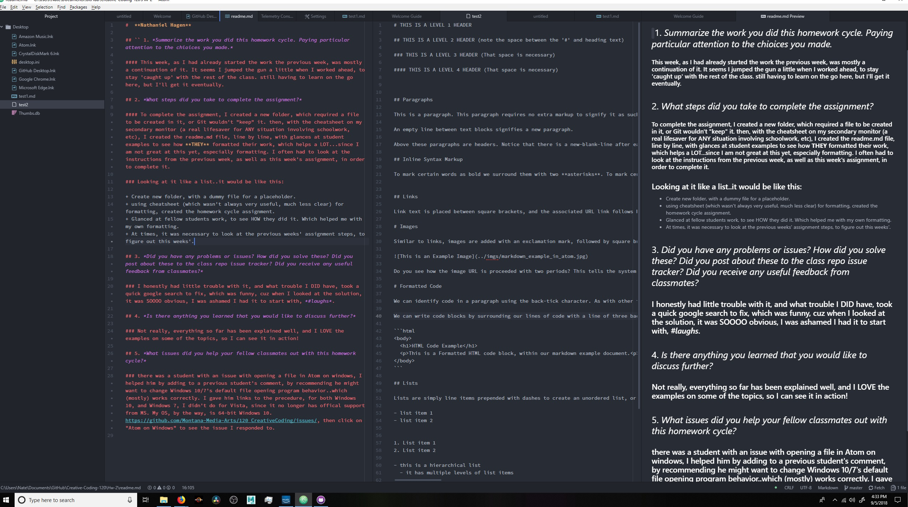

#  **Nathaniel Hagen**

## 1. *Summarize the work you did this homework cycle. Paying particular attention to the chioices you made.*

### This week, as I had already started the work the previous week, was mostly a continuation of it. It seems I jumped the gun a little when I worked ahead, to stay 'caught up' with the rest of the class. still having to learn on the go here, but I'll get it eventually.

## 2. *What steps did you take to complete the assignment?*

### To complete the assignment, I created a new folder, which required a file to be created in it, or Git wouldn't "keep" it. then, with the cheatsheet on my secondary monitor (a real lifesaver for ANY situation involving schoolwork, etc), I created the readme.md file, line by line, with glances at student examples to see how **THEY** formatted their work, which helps a LOT...since I am not great at this yet, especially formatting. I often had to look at the instructions from the previous week, as well as this week's assignment, in order to complete it.

### Looking at it like a list..it would be like this:

+ Create new folder, with a dummy file for a placeholder.
+ using cheatsheet (which wasn't always very useful, much less clear) for formatting, created the homework cycle assignment.
+ Glanced at fellow students work, to see HOW they did it. Which helped me with my own formatting.
+ At times, it was necessary to look at the previous weeks' assignment steps, to figure out this weeks'.

## 3. *Did you have any problems or issues? How did you solve these? Did you post about these to the class repo issue tracker? Did you receive any useful feedback from classmates?*

### I honestly had little trouble with it, and what trouble I DID have, took a quick google search to fix, which was funny, cuz when I looked at the solution, it was SOOOO obvious, I was ashamed I had it to start with, *#laughs*.

## 4. *Is there anything you learned that you would like to discuss further?*

### Not really, everything so far has been explained well, and I LOVE the examples on some of the topics, so I can see it in action!

## 5. *What issues did you help your fellow classmates out with this homework cycle?*

### there was a student with an issue with opening a file in Atom on windows, I helped him by adding to a previous student's comment, by recommending he might want to change Windows 10/7's default file opening program behavior..which (mostly) works correctly. I gave him links to the precedure, for both Windows 10, and Windows 7, I didn't do for Vista, since it no longer has offical support from MS. My OS, by the way, is 64-bit Windows 10. https://github.com/Montana-Media-Arts/120_CreativeCoding/issues/, then click on  "Atom on Windows" to see the issue I responded to.

### Image of my editor:

